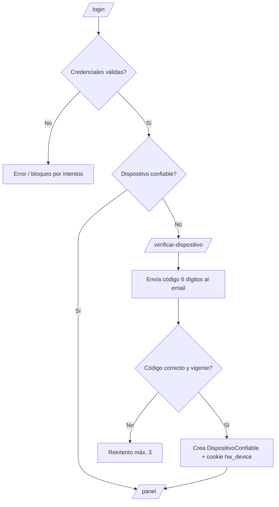
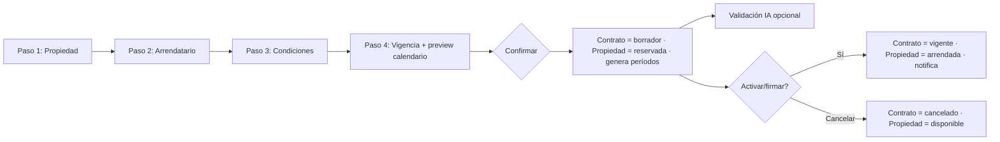
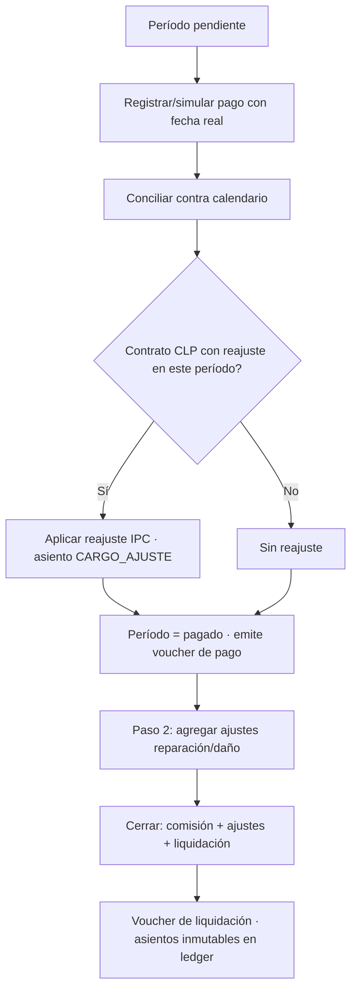

# Diagramas de flujo y mapa de navegación

> El camino que sigue el usuario por la aplicación y la lógica que ejecuta el sistema ante cada decisión. Los diagramas usan **Mermaid** (se renderizan en GitHub/VS Code).

## 1. Mapa de navegación (rutas)

Tres superficies con niveles de acceso distintos.

```
PÚBLICO (sin auth)
├── /                          Landing corporativa
├── /marketplace               Listado con filtros
│   └── /marketplace/[id]       Ficha de propiedad (contacto · denuncia · valoración)
├── /terminos-uso              Términos y condiciones
├── /privacidad                Política de privacidad
├── /login                     Ingreso corredor
├── /registro                  Crear cuenta corredora
├── /recuperar-contrasena  →  /nueva-contrasena?token=…
└── /verificar-dispositivo     2FA (post-login, dispositivo nuevo)

PORTAL (sesión hw_portal, solo lectura, 30 min)
├── /portal                    Ingreso por RUT
├── /portal/verificar          Código OTP
└── /portal/contrato/[id]      Mi arriendo: pagos (filtro por año) · documentos · mensajes · valorar

PANEL (sesión hw_session + dispositivo verificado)
├── /panel                     Dashboard (KPIs, próximos vencimientos)
├── /panel/propiedades         CRUD + ciclo de vida + imágenes
├── /panel/contratos           Listado
│   ├── /panel/contratos/nuevo  Wizard 4 pasos
│   └── /panel/contratos/[id]   Detalle: Vigencia · Períodos · Documentos · Mensajes · Ledger
├── /panel/cobros              Conciliación + asistente de liquidación
├── /panel/vouchers            Historial con filtros
├── /panel/notificaciones      Recordatorios / envíos
└── /panel/perfil              Datos + dispositivos de confianza
```

**Reglas de acceso (proxy + capa de datos):** el `proxy.ts` redirige según sesión; la autorización real (tenant, propiedad del recurso) se valida en cada Server Action / Route Handler.

---

## 2. Autenticación del corredor + 2FA



---

## 3. Crear contrato → firma → vigencia



---

## 4. Conciliación y liquidación (el núcleo)



---

## 5. Portal de autoconsulta (arrendatario/propietario)

```mermaid
flowchart TD
    A[/portal/ ingresa RUT] --> B[POST solicitar-otp]
    B --> C[Respuesta idéntica exista o no el RUT]
    C --> D[Si existe: envía OTP al contacto registrado]
    D --> E[/portal/verificar/ ingresa código]
    E --> F{OTP válido?}
    F -- No --> E2[Reintento / expira 10 min]
    F -- Sí --> G[Sesión hw_portal solo lectura 30 min]
    G --> H[/portal/contrato/id/]
    H --> I[Pagos con filtro por año]
    H --> J[Descarga documentos autenticada + audit log]
    H --> K[Mensajes del corredor]
    H --> L[Valorar corredor token único]
```

---

## 6. Marketplace: contacto → valoración

```mermaid
flowchart LR
    A[/marketplace/ filtros] --> B[/marketplace/id/ ficha]
    B --> C[Contactar corredor]
    C --> D[Crea ConsultaContacto + token valoración]
    D --> E[Notifica al corredor]
    D --> F[Entrega token de un solo uso]
    F --> G[Valorar 1-5 estrellas]
    G --> H{Token válido y no usado?}
    H -- Sí --> I[Registra valoración · quema token]
    H -- No --> J[Rechaza]
    B --> K[Denunciar propiedad/corredor]
```

---

> Detalle de cada paso e interacción: [historias de usuario](historias-de-usuario.md). Reglas de negocio subyacentes: [modelo de dominio](modelo-dominio.md).
