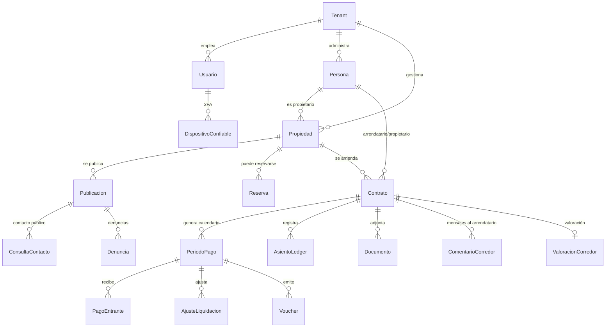

# Modelo de datos y diagrama ER

> Diccionario de datos del MVP. La **fuente de verdad exhaustiva** es [`apps/web/prisma/schema.prisma`](../../apps/web/prisma/schema.prisma) (columnas, tipos, `@map`) y [`apps/web/prisma/sql/setup.sql`](../../apps/web/prisma/sql/setup.sql) (RLS, trigger inmutable, índices parciales y vistas, que Prisma no modela). Este documento resume estructura, relaciones y reglas para lectura humana.

## Convenciones

- **PKs** `uuid` (`gen_random_uuid()`), salvo las series temporales (PK por fecha).
- **Dinero** en `NUMERIC`/`Decimal` (nunca `float`). CLP con 0 decimales; UF y valores origen con 2–4.
- **Multi-tenant:** casi todo lleva `tenant_id` con **Row-Level Security** (una corredora = un `tenant`).
- **Ledger inmutable:** `asiento_ledger` no admite `UPDATE`/`DELETE` (trigger); se corrige con asientos de reversa.
- **Fechas** en `timestamptz` (auditoría) o `date` (eventos de negocio).

---

## Diagrama ER (entidades núcleo)

---

## Diccionario de datos

### Núcleo multi-tenant

| Tabla | Descripción | Campos clave |
|---|---|---|
| `tenant` | La corredora (unidad de aislamiento). | `nombre`, `plan`, `email_contacto`, `ventana_liquidacion_dias`, `recordatorio_dias_antes` |
| `usuario` | Staff de la corredora (único con cuenta). | `rol` (admin/operador), `email`, `rut` (único global), `password_hash` (PBKDF2), `failed_attempts`/`locked_until`, `consent_given_at`/`consent_version`, `perfil_completo` |
| `persona` | Propietarios y arrendatarios (**sin cuenta**). | `rut` (único por tenant), `email`, `telefono`, `canal_acceso_pref` |

### Propiedades y publicación

| Tabla | Descripción | Campos clave |
|---|---|---|
| `propiedad` | Inmueble administrado. | `tipo` (casa/departamento/cabana), `estado` (borrador/disponible/reservada/arrendada), `direccion`, `comuna`, `region`, `m2_construidos`/`m2_totales`, `piezas`, `banos`, `estacionamientos`, `paga_gastos_comunes`, `acepta_mascotas` |
| `imagen_propiedad` | Imágenes (orden). | `url`, `orden` (cascade delete) |
| `publicacion` | Aviso en el marketplace. | `estado` (borrador/publicada/bajada), `titulo`, `precio_referencia`, `denominacion_precio`, `publicada_en` |
| `reserva` | Reserva previa al contrato. | `estado` (activa/cancelada/convertida), `fecha_reserva`, `vigente_hasta` |

### Contratos y finanzas (el núcleo real)

| Tabla | Descripción | Campos clave |
|---|---|---|
| `contrato` | Contrato de arriendo. | `estado` (borrador/vigente/terminado/terminado_anticipado/cancelado), `denominacion` (UF/CLP), `valor_arriendo`, `dia_vencimiento`, `comision_corredor_pct`, `reajuste` (anual/semestral/ninguna), `mora_tasa_pct`/`mora_dias_gracia`, `multa_meses`, `garantia_meses`/`garantia_monto_clp`, `fecha_inicio`/`fecha_fin`/`fecha_termino`, `validacion_ia`+`validacion_estado`, `token_valoracion`/`valoracion_dada` |
| `periodo_pago` | Cada mes del calendario. | `numero`, `fecha_vencimiento`, `monto_base`, `monto_gasto_comun`, `estado` (pendiente/pagado/liquidado/atrasado/en_revision/cancelado), `fecha_pago_real` · único `(contrato, numero)` |
| `ajuste_liquidacion` | Ajustes antes de cerrar liquidación (ADR-0008). | `tipo` (descuento_propietario/cargo_arrendatario/retencion), `monto_clp`, `descripcion` |
| `pago_entrante` | Pago recibido (real o simulado). | `monto_clp`, `fecha_pago_real`, `canal` (PAC/pago_facil/transferencia_declarada), `estado`, `declaracion_jurada`, `origen` |
| `asiento_ledger` | **Ledger contable inmutable** (append-only). | `tipo` (12 tipos: CARGO_*, PAGO_RECIBIDO, COMISION_CORREDOR, LIQUIDACION_PROPIETARIO, *_GARANTIA…), `signo`, `monto_clp`, `moneda_origen`/`valor_origen`/`uf_aplicada`, `fecha_evento`, `reversa_de` |
| `voucher` | Comprobante inmutable (pago o liquidación). | `tipo` (pago/liquidacion), `monto_clp`, `snapshot` (JsonB), `fecha` |

### Documentos y comunicación

| Tabla | Descripción | Campos clave |
|---|---|---|
| `documento` | Archivo asociado (polimórfico). | `tipo` (contrato/anexo/comprobante_pago/certificado_reserva/reconocimiento_deuda/otro), `storage_key`, FKs opcionales a contrato/propiedad/periodo/voucher/reserva/comentario |
| `notificacion` | Aviso a una parte. | `tipo` (10: cobro, voucher_pago, recordatorio_vencimiento, …, comentario_corredor), `canal` (email), `estado` (pendiente/simulada/enviada), `asunto`, `enviada_en` |
| `comentario_corredor` | Mensaje del corredor al arrendatario (portal). | `texto`, `usuario_nombre` (desnormalizado), documentos adjuntos |

### Portal y auditoría

| Tabla | Descripción | Campos clave |
|---|---|---|
| `acceso_otp` | Código OTP del portal. | `codigo_hash`, `expira_en`, `intentos`/`max_intentos`, `usado_en`, `ip_solicitud` |
| `acceso_log` | Auditoría de accesos (a docs, portal). | `accion`, `documento_id`, `ip` |

### Seguridad de cuenta (corredor)

| Tabla | Descripción | Campos clave |
|---|---|---|
| `dispositivo_confiable` | Dispositivo verificado (2FA). | `token_hash` (SHA-256), `nombre`, `last_seen_at` (cascade delete) |
| `codigo_dispositivo` | Código de verificación de dispositivo. | `codigo_hash`, `device_token`, `expira_at`, `intentos` |
| `reset_token` | Token de recuperación de contraseña (un solo uso). | `token_hash` (SHA-256), `expires_at`, `usado_en` |

### Marketplace social

| Tabla | Descripción | Campos clave |
|---|---|---|
| `consulta_contacto` | Formulario de contacto público. | `nombre`/`apellido`/`email`/`telefono`, `titulo`/`descripcion`, `token_valoracion` (único, un solo uso), `via_email`/`via_telefono` |
| `denuncia` | Denuncia de propiedad/corredor. | `tipo` (fraude/estafa/…), `objetivo` (propiedad/corredor), `descripcion`, `es_anonima`, `declara_veracidad`, `acepta_tratamiento_datos`, `estado` |
| `valoracion_corredor` | Rating 1–5 del corredor. | `estrellas`, `comentario`, `es_visible`, origen (`consulta_id` **o** `contrato_id`, únicos) |

### Series temporales globales (sin tenant)

| Tabla | Descripción | Campos clave |
|---|---|---|
| `serie_uf` | Valor diario de la UF. | PK `fecha`, `valor_clp` |
| `serie_ipc` | Índice IPC mensual. | PK `periodo`, `indice` |

---

## Capa SQL (fuera de Prisma) — `setup.sql`

- **RLS** activada por `tenant_id` en las ~15 tablas con tenant. En dev el rol dueño la bypassa; en producción se usa un rol `housing_app` no-dueño para que la BD **fuerce** el aislamiento.
- **Trigger de inmutabilidad** sobre `asiento_ledger`: rechaza `UPDATE`/`DELETE` (auditoría contable).
- **Índice único parcial** para evitar duplicados en estados activos.
- **Vistas de saldos:** `v_deuda_arrendatario`, `v_billetera_propietario` (gasto común excluido — es passthrough), `v_garantia_retenida`.

## Enums principales

`RolUsuario`, `TipoPropiedad`, `EstadoPropiedad`, `Denominacion`, `FrecuenciaReajuste`, `EstadoContrato`, `EstadoPeriodo`, `EstadoPublicacion`, `EstadoReserva`, `EstadoPago`, `CanalPago`, `TipoConcepto`, `TipoAjuste`, `TipoVoucher`, `TipoAsiento` (12), `TipoNotificacion` (10), `EstadoNotificacion`, `TipoDocumento`, `CanalOtp`, `TipoDenuncia`, `ObjetivoDenuncia`. Valores completos en `schema.prisma`.

---

> Reglas de negocio que dan sentido a este modelo: [modelo de dominio](../funcional/modelo-dominio.md). Decisiones: [ADR-0004](../decisiones/ADR-0004-reglas-financieras.md) (reglas financieras), [ADR-0007](../decisiones/ADR-0007-portal-autoconsulta-otp.md) (portal/OTP), [ADR-0008](../decisiones/ADR-0008-liquidacion-y-ajustes.md) (liquidación), [ADR-0009](../decisiones/ADR-0009-garantia-y-reconocimiento-deuda.md) (garantía).
